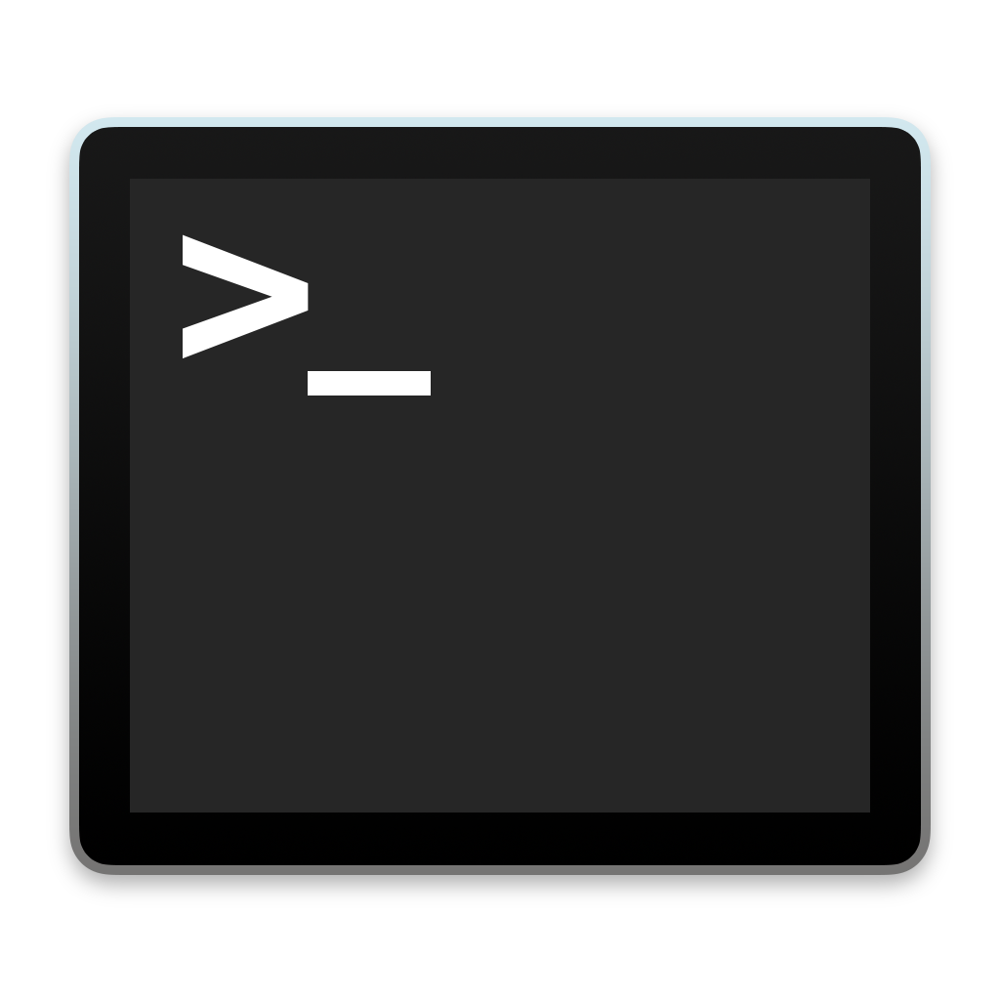
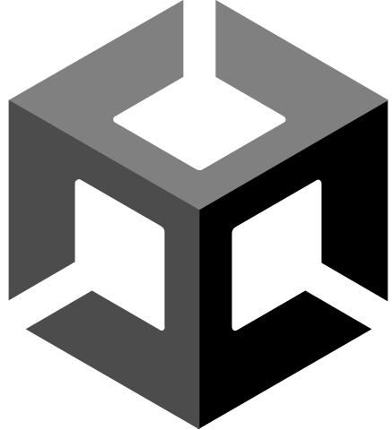

<!--  header -->

<h1>
Hi I'm Tim

</h1>

 

 

<!--  technologies -->

<h3>My Toolkit</h3 style="vertical-align: center;">
<!--zshell-->
<!--rust-->
<!--python-->
<!--react-->
<!--nodejs-->
<!--c#-->
<!--unity-->
<!--git-->
<!--javascript-->
<!--html-->
<!--java-->
<!--neovim-->
<!--tensorflow-->
<!--css-->
<!--blender-->
<!--typescript-->
<!--emacs-->
<!--c-->

